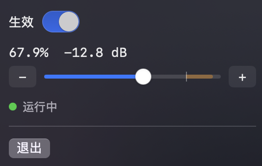

# Volumn

macOS 菜单栏小工具：在**软件层**调节所有应用的输出音量，让低音量区的每一档都听得出差别。

<p align="center"></p>

## 为什么做它

给背景音乐（BGM）找一个“刚刚好”的音量，往往卡在系统音量的最低几格：

- 系统音量的最低一两格往往已经偏大，下一格又跳得太多，**中间的音量调不出来**；
- 接 3.5mm 线路输出（音箱、功放）时，系统音量甚至**根本不能调**。

Volumn 在系统音量之外再加一层精细的软件音量，并且把调节精度集中放在低音量区：

- 音量与 **dB** 成分段线性，人耳按对数感知，因此每一档听感均匀；
- 低音量区（0~20%）每 1% 约 1.4 dB，**每一档变化都听得出来**；
- `−` / `+` 按钮每次只动 **0.1%**，按住可连续加速；滑块可以拖到任意位置；
- 想让声音更大时，100% 之后还有橙色**增强区**（最高 +6 dB，带软限幅防破音）。

调到合适的位置后，音量会被记住，下次启动继续生效。

## 安装

需要 macOS 14.2 及以上。

```bash
brew install --cask shoaly/volumn/volumn
```

装好后打开 Volumn，第一次在「系统设置 → 隐私与安全性 → 系统音频录制」里允许它。

升级：`brew upgrade --cask volumn`　卸载：`brew uninstall --cask volumn`

## 使用

- 菜单栏出现扬声器图标：实心表示已生效，轮廓表示未生效；
- **生效**开关：打开后接管所有应用的声音；关闭后声音完全恢复原状；
- 拖动滑块或点击 `−` / `+`：开关为关时会自动打开；
- 滑块 0 为静音，**100% 为原声**（0 dB），100% 以上为增强区（橙色）；
- 面板下方的状态行会显示运行状态：运行中 / 输出设备已切换 / 未授予权限等。

## 工作原理

```
所有应用的声音 → Core Audio Process Tap（静音原输出，排除 Volumn 自身）→ 乘增益 → 当前默认输出设备
```

- 使用 macOS 14.2 引入的 Process Tap 截取全部应用的输出，在软件层乘以增益后，播放到当前默认输出设备；
- 切换输出设备、睡眠唤醒后会自动重建；
- 增益变化一律走 10 ms 线性斜坡，开关切换前后有淡入淡出，避免爆音和杂音；
- 退出应用或进程被杀掉，系统会自动销毁 Tap，原声立即恢复。

## 隐私

音频只在本机内存里处理，不联网、不保存。「系统音频录制」权限仅用于截取并重新播放声音。

## 说明

- 开启期间，所有应用（含系统提示音）的声音都会经过 Volumn；Volumn 自身的声音除外；
- 受保护内容（部分流媒体视频）是否能被截取，取决于系统策略；
- 如果同时在系统里调了音量，最终音量是系统音量与 Volumn 的叠加。
